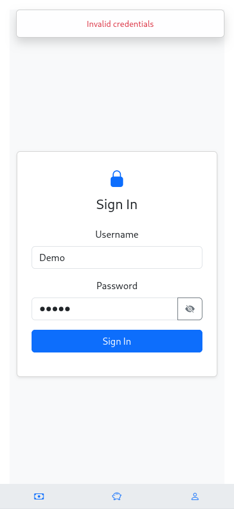
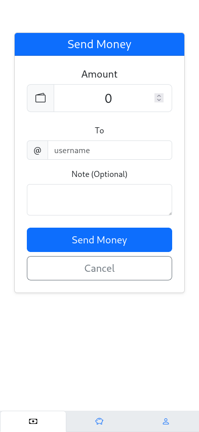
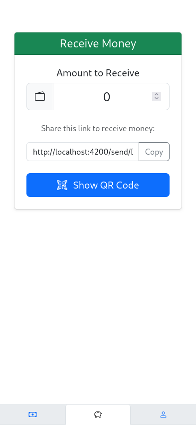

# FakeMoney
**A PayPal-like payment processor for virtual money, intended to be used for [simulation games](https://de.wikipedia.org/wiki/Schule_als_Staat).**

Send and receive money from your account and businesses you own using simple URLs and QR codes.
Install as a [PWA](https://developer.mozilla.org/en-US/docs/Web/Progressive_web_apps)
from your browser (Firefox/Chrome/Safari) with just 3 taps and bypass tedious app store processes.

&nbsp;
&nbsp;
&nbsp;

## Deployment
Is simplified using Docker and by making a few assumptions, e.g. that API and frontend are available under the same domain.
## Development

### Frontend
Is written in angular + bootstrap.

### Backend
Uses NextJS + PostgreSQL with JWT as cookies.